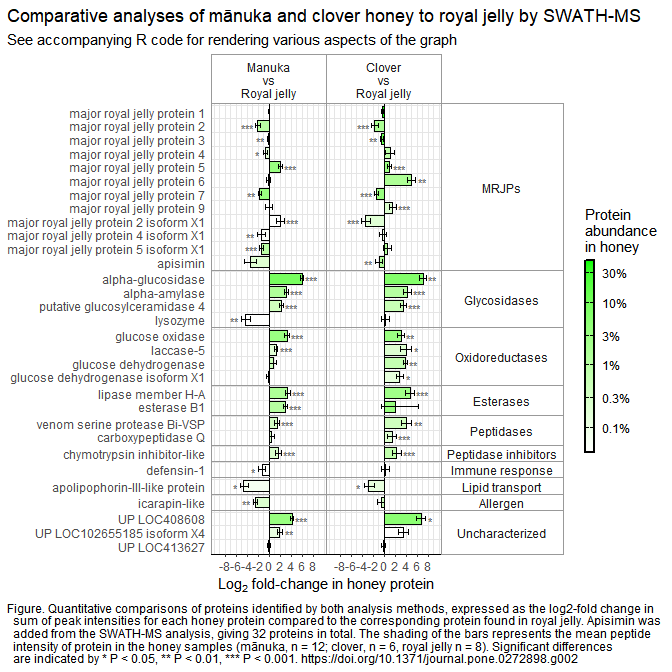

Plotting quantitative mass spec data with ggplot
================
Blake Paget
2021

- [Background](#background)
- [R script](#r-script)
- [Summary](#summary)

## Background

The full methodology and underlying data (as supplementary) can be found
at PLOS One within the research article referenced below.<br> <br> Paget
BW, Kleffmann T, Whiteman KE, Thomas MF, McMahon CD (2023) Quantitative
comparison of manuka and clover honey proteomes with royal jelly. PLOS
ONE 18(2): e0272898. <https://doi.org/10.1371/journal.pone.0272898><br>
<br>

In brief:<br>

- Samples consisted of 12 manuka honey, 6 clover honey and 8 royal
  jelly.
- Protein was extracted by dialysis and analysed by SWATH-MS at the
  University of Otago.
- MS search database included all *Apis mellifera* NCBI RefSeq proteins.
- For manuka samples 4 technical replicate LC-MS runs were performed,
  while clover and royal jelly had 3 technical replicates.
- Normalised label-free quantitation data were tested for variance and
  normality using Fisher’s test and Shapiro-Wilk test, respectively.
- A non-parametric bootstrap method was used to calculate 95% confidence
  intervals for biological replicates and p-values for the difference of
  means, using 10,000 replicates. <br>

Notes on the data received:<br>

- The samples were submitted at two different times - the manuka samples
  were analysed first on a 90 minute LC gradient, then several months
  later the clover and royal jelly samples were requested to be analysed
  in the exact same manner. However, it transpired that the clover
  samples were apparently not concentrated enough to run a 90 minute
  gradient, so instead this was shortened to a 60 minute gradient.
- The loss of clover protein must have occured during MS prep as all
  submitted samples were a similar concentration.
- Unfortunately we were not informed prior to the analysis and could
  easily have supplied more concentrated samples.
- The royal jelly samples were therefore separated over 90 and 60 minute
  gradients. Hence the data only allows accurate comparison of manuka to
  royal jelly and separately clover to royal jelly.<br> <br>

## R script

#### Import data

The csv files containing quantitative data were previously prepared in
R.<br> <br>

``` r
# Load libraies.
library(tidyverse)
library(janitor)
```

<br>

``` r
# Import relative quantification data.
quant <- read_csv("Quantitative_comparisons_2021.csv")
names(quant) <- make.names(names(quant))
glimpse(quant)
```

    ## Rows: 62
    ## Columns: 12
    ## $ Comparison          <chr> "M_vs_R", "M_vs_R", "M_vs_R", "M_vs_R", "M_vs_R", …
    ## $ Protein             <chr> "NP_001011574.1", "NP_001011579.1", "NP_001011580.…
    ## $ Protein.Description <chr> "glucose oxidase [Apis mellifera]", "major royal j…
    ## $ Log2.Fold.Change    <dbl> 3.20902815, -0.05978517, -2.09916123, 3.02842458, …
    ## $ Log2.Min            <dbl> 2.820538493, -0.192407000, -2.509150983, 2.6719463…
    ## $ Log2.Max            <dbl> 3.60554061, 0.06473508, -1.58129208, 3.39412300, 2…
    ## $ Fold.Change         <dbl> 9.24727406, 0.95940697, 0.23339390, 8.15918233, 4.…
    ## $ Min.Fold.Change     <dbl> 7.06426025, 0.87514441, 0.17565895, 6.37288377, 3.…
    ## $ Max.Fold.Change     <dbl> 12.17239043, 1.04589287, 0.33418246, 10.51314932, …
    ## $ Adjusted.P.Value    <dbl> 0.00009999, 0.30926907, 0.00059994, 0.00009999, 0.…
    ## $ group_order         <dbl> 35, 1, 3, 27, 9, 5, 25, 7, 53, 11, 57, 13, 15, 55,…
    ## $ function.           <chr> "Oxidoreductases", "MRJPs", "MRJPs", "Glycosidases…

``` r
# Import protein abundance data.
intens <- read_csv("intensity_comparisons_2021.csv")
names(intens) <- make.names(names(intens))
glimpse(intens)
```

    ## Rows: 62
    ## Columns: 4
    ## $ Comparison          <chr> "M_vs_R", "M_vs_R", "M_vs_R", "M_vs_R", "M_vs_R", …
    ## $ Protein.Name        <chr> "NP_001011574.1", "NP_001011579.1", "NP_001011580.…
    ## $ Protein.Description <chr> "glucose oxidase [Apis mellifera]", "major royal j…
    ## $ Mean                <dbl> 0.031170746, 0.475061363, 0.009634278, 0.014237878…

<br>

#### Process data

Data was checked for unique accessions in each table then merged.
Protein descriptions were shortened. The positions of asterisk
characters indicating statistical significance were calculated.<br> <br>

``` r
# Check for a primary key in each data set.
compare_df_cols(quant, intens)
```

    ##            column_name     quant    intens
    ## 1     Adjusted.P.Value   numeric      <NA>
    ## 2           Comparison character character
    ## 3          Fold.Change   numeric      <NA>
    ## 4            function. character      <NA>
    ## 5          group_order   numeric      <NA>
    ## 6     Log2.Fold.Change   numeric      <NA>
    ## 7             Log2.Max   numeric      <NA>
    ## 8             Log2.Min   numeric      <NA>
    ## 9      Max.Fold.Change   numeric      <NA>
    ## 10                Mean      <NA>   numeric
    ## 11     Min.Fold.Change   numeric      <NA>
    ## 12             Protein character      <NA>
    ## 13 Protein.Description character character
    ## 14        Protein.Name      <NA> character

``` r
# quant$Protein unique?
nrow(quant) == nrow(unique(quant[, c('Comparison', 'Protein')]))
```

    ## [1] TRUE

``` r
# intens$Protein.Name unique?
nrow(intens) == nrow(unique(intens[, c('Comparison', 'Protein.Name')]))
```

    ## [1] TRUE

<br>

``` r
# Merge on Comparison, Protein.Description, Protein/Protein.Name.
intens <- rename(intens, Protein = Protein.Name)
df <- merge(quant, intens, by = c("Comparison", "Protein.Description", "Protein"))
glimpse(df)
```

    ## Rows: 62
    ## Columns: 13
    ## $ Comparison          <chr> "C_vs_R", "C_vs_R", "C_vs_R", "C_vs_R", "C_vs_R", …
    ## $ Protein.Description <chr> "alpha-amylase precursor [Apis mellifera]", "alpha…
    ## $ Protein             <chr> "NP_001011598.1", "NP_001011608.1", "NP_001011582.…
    ## $ Log2.Fold.Change    <dbl> 4.2344706, 7.1113683, -0.9336734, -2.8610397, 1.42…
    ## $ Log2.Min            <dbl> 3.5351197, 6.4762183, -1.5613329, -3.6658257, 0.60…
    ## $ Log2.Max            <dbl> 4.91842489, 7.69442950, -0.31712759, -1.75223369, …
    ## $ Fold.Change         <dbl> 18.82359898, 138.27229440, 0.52352365, 0.13763892,…
    ## $ Min.Fold.Change     <dbl> 11.59249878, 89.02991406, 0.33883788, 0.07879098, …
    ## $ Max.Fold.Change     <dbl> 30.2408102, 207.1352818, 0.8026664, 0.2968418, 4.7…
    ## $ Adjusted.P.Value    <dbl> 0.00059994, 0.00159984, 0.00669933, 0.01539846, 0.…
    ## $ group_order         <dbl> 28, 26, 24, 56, 50, 52, 54, 46, 40, 42, 36, 58, 38…
    ## $ function.           <chr> "Glycosidases", "Glycosidases", "MRJPs", "Lipid tr…
    ## $ Mean                <dbl> 0.011216027, 0.064965485, 0.011528805, 0.001321284…

<br>

``` r
# Clean up descriptions.
to_remove <- c(" \\[Apis mellifera\\]", " precursor", " preproprotein", " \\[FAD, quinone\\]")
df <- 
  df %>% 
  mutate(Protein.Description = str_remove_all(Protein.Description, paste(to_remove, collapse = "|"))) %>% 
  mutate(Protein.Description = str_replace_all(Protein.Description, "uncharacterized protein", "UP"))
```

<br>

``` r
# Calculate coordinates for significance symbols, define significance labels.
lab_pos_adjust <- 1.5
df$lab_pos <- ifelse(df$Log2.Fold.Change > 0, df$Log2.Max + lab_pos_adjust, df$Log2.Min - lab_pos_adjust)
df$sig_pos <- 
  case_when(
    df$lab_pos < 0 ~ case_when(
      df$Adjusted.P.Value < 0.001 ~ "***",
      df$Adjusted.P.Value < 0.01 ~ " **",
      df$Adjusted.P.Value < 0.05 ~ "  *",
      .default = ""
    ),
    .default = case_when(
      df$Adjusted.P.Value < 0.001 ~ "***",
      df$Adjusted.P.Value < 0.01 ~ "** ",
      df$Adjusted.P.Value < 0.05 ~ "*  ",
      .default = ""
    )
  )
```

<br>

#### Plot setup

The facet_grid labeller requires a vector of named labels to label the
facets. The names should be factors in the data supplied to the ggplot
function. Outlying low or high values for the ‘fill’ aesthetic will
stretch the legend beyond the manually applied breaks and labels, and
produce a skewed colour filling of the bars. A low outlier for M_vs_R,
lysozyme was manually changed to prevent this happening, so that
lysozyme still appears as the lowest fill value (indistinguishable when
viewing the graph) but preserves the manually changed fill legend
appearance.<br> <br>

``` r
# Define the labels for the facet_grid.
comparison_names <- c('M_vs_R' = "Manuka\nvs\nRoyal jelly",
                      'C_vs_R' = "Clover\nvs\nRoyal jelly",
                      'MRJPs' = "MRJPs",
                      'Glycosidases' = "Glycosidases",
                      'Oxidoreductases' = "Oxidoreductases",
                      'Esterases' = "Esterases",
                      'Peptidases' = "Peptidases",
                      'Peptidase inhibitors' = "Peptidase inhibitors",
                      'Immune response' = "Immune response",
                      'Lipid transport' = "Lipid transport",
                      'Allergen' = "Allergen",
                      'Uncharacterized' = "Uncharacterized")
```

<br>

``` r
# Make all the labels factors in the dataframe.
df$Comparison <- factor(df$Comparison, levels = c("M_vs_R", "C_vs_R"))
df$function. <- factor(df$function., levels = c("MRJPs", "Glycosidases", "Oxidoreductases", "Esterases", "Peptidases", "Peptidase inhibitors", "Immune response", "Lipid transport", "Allergen", "Uncharacterized"))
```

``` r
# Final glimpse of types.
glimpse(df)
```

    ## Rows: 62
    ## Columns: 15
    ## $ Comparison          <fct> C_vs_R, C_vs_R, C_vs_R, C_vs_R, C_vs_R, C_vs_R, C_…
    ## $ Protein.Description <chr> "alpha-amylase", "alpha-glucosidase", "apisimin", …
    ## $ Protein             <chr> "NP_001011598.1", "NP_001011608.1", "NP_001011582.…
    ## $ Log2.Fold.Change    <dbl> 4.2344706, 7.1113683, -0.9336734, -2.8610397, 1.42…
    ## $ Log2.Min            <dbl> 3.5351197, 6.4762183, -1.5613329, -3.6658257, 0.60…
    ## $ Log2.Max            <dbl> 4.91842489, 7.69442950, -0.31712759, -1.75223369, …
    ## $ Fold.Change         <dbl> 18.82359898, 138.27229440, 0.52352365, 0.13763892,…
    ## $ Min.Fold.Change     <dbl> 11.59249878, 89.02991406, 0.33883788, 0.07879098, …
    ## $ Max.Fold.Change     <dbl> 30.2408102, 207.1352818, 0.8026664, 0.2968418, 4.7…
    ## $ Adjusted.P.Value    <dbl> 0.00059994, 0.00159984, 0.00669933, 0.01539846, 0.…
    ## $ group_order         <dbl> 28, 26, 24, 56, 50, 52, 54, 46, 40, 42, 36, 58, 38…
    ## $ function.           <fct> Glycosidases, Glycosidases, MRJPs, Lipid transport…
    ## $ Mean                <dbl> 0.011216027, 0.064965485, 0.011528805, 0.001321284…
    ## $ lab_pos             <dbl> 6.418425, 9.194430, -3.061333, -5.165826, 3.757755…
    ## $ sig_pos             <chr> "***", "** ", " **", "  *", "***", "***", "", "", …

``` r
# Specifically edit the Mean value for "Comparison == 'M_vs_R' & Protein.Description == 'lysozyme'" because it is 100x less than any other and stretches the legend down to below 0.001%.
df <- df %>% mutate(Mean = ifelse(Comparison == "M_vs_R" & Protein.Description == 'lysozyme', 0.00041, Mean))
```

<br>

#### Plot

Some plot variables can be defined prior to the call to ggplot to tidy
up that code. If multiple graphs were to be produced then some of the
core theme components could be grouped under a single variable just like
the built-int themes are e.g. theme_classic(), theme_minimal(). It might
be that one of these built-in themes is very close to what I have
produced here. <br>

``` r
# Easily change the bar fill colour below.
fill_colour <- "green"

# Titles and caption.
title <- "Comparative analyses of mānuka and clover honey to royal jelly by SWATH-MS"
subtitle <- "See accompanying R code for rendering various aspects of the graph"
caption <- 
  "Figure. Quantitative comparisons of proteins identified by both analysis methods, expressed as the log2-fold change in
  sum of peak intensities for each honey protein compared to the corresponding protein found in royal jelly. Apisimin was
  added from the SWATH-MS analysis, giving 32 proteins in total. The shading of the bars represents the mean peptide
  intensity of protein in the honey samples (mānuka, n = 12; clover, n = 6, royal jelly n = 8). Significant differences
  are indicated by * P < 0.05, ** P < 0.01, *** P < 0.001. https://doi.org/10.1371/journal.pone.0272898.g002"

# Plot.
ggplot(data = df,
       mapping = aes(x = Log2.Fold.Change, y = reorder(Protein.Description, desc(group_order)))) +
  geom_bar(data = df,
           aes(fill = Mean),
           stat = "identity",
           color = "black",
           width = 0.8) +
  geom_errorbar(width = 0.4,
                aes(xmin = Log2.Min, xmax = Log2.Max)) +
  scale_fill_gradient(guide = "legend",
                      low = "white",
                      high = fill_colour,
                      trans = "log10",
                      breaks = c(0.001, 0.003, 0.01, 0.03, 0.1, 0.30),
                      labels = c("0.1%", "0.3%", "1%", "3%", "10%", "30%")) +
  scale_x_continuous(limits = c(-9.5, 9.5),
                     breaks = c(-8, -6, -4, -2, 0, 2, 4, 6, 8)) +
  labs(title = title,
       subtitle = subtitle,
       caption = caption, 
       x = expression(paste(Log[2], " fold-change in honey protein")),
       y = NULL) +
  theme(panel.border = element_rect(color = "grey60", fill = NA),
        axis.line.x = element_line(color = "black"),
        axis.ticks.y = element_blank(),
        panel.grid.major.y=element_blank(),
        panel.background = element_blank(),
        panel.grid = element_line(color = "grey90"),
        panel.grid.major.x = element_line(linewidth = 0.25),
        legend.position = "right",
        plot.caption.position = "plot",
        plot.caption = element_text(hjust = 0),
        plot.title.position = "plot",
        panel.spacing = unit(0, "lines"),
        strip.placement = "outside",
        strip.text.y.right = element_text(angle = 0),
        strip.background = element_rect(color = "grey60", fill = "white")) +
  guides(fill = guide_colorbar("Protein\nabundance\nin honey",
                               barwidth = 0.5, barheight = 10,
                               ticks.colour = "black",
                               frame.colour = "black",
                               frame.linewidth = 0.8)) +
  geom_hline(yintercept = seq(1.5, length(unique(df$Protein.Description))-0.5, 1),
             lwd = 0.2,
             color = "grey90") +
  geom_vline(xintercept = 0) +
  geom_text(aes(x = lab_pos, label = sig_pos),
            position = position_dodge(0.9),
            vjust = 0.7,
            size = 3,
            color = "grey30") +
  facet_grid(function. ~ Comparison,
             scales = "free_y",
             space = "free_y",
             labeller = as_labeller(comparison_names))
```

 <br>
<br> <br>

## Summary

The way the data was collected made it difficult to compare samples in
the manner we would have liked. Obvioulsy if all data were collected in
the same way then relative quantities could be compared between the
three sample types. Graphs would most likely be grouped by MRJPs, known
enzymes, remaining characterised proteins and uncharacterised proteins
for better clarity and ease of interpretation with all three sample
types compared in grouped bars.<br> <br> <br> <br> <br> <br> <br> <br>
<br> <br> <br> <br> <br> <br> <br> <br> <br> <br> <br> <br> <br> *End of
document*
